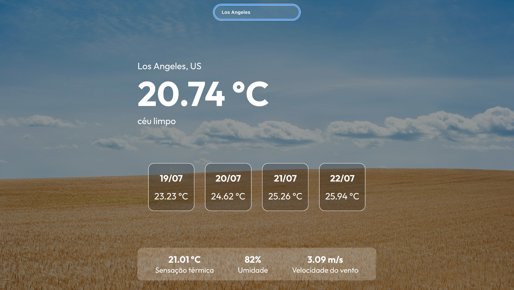

# Página web de previsão de tempo 
O projeto foi desenvolvido por Joaquim Chianca e Lucas Agnez para a disciplina de Framework em Javascript no semestre 2023.1.

## Descrição
O projeto consiste numa página web desenvolvida em React com Javascript.


A ideia é digitar um nome de uma cidade no campo de pesquisa e são mostradas informações como: temperatura atual, sensação térmica, umidade do ar, velocidade do vento e também uma previsão da temperatura para os próximos 4 dias.

O projeto faz uso da APIs de [Current weather data](https://openweathermap.org/current) e [5 day weather forecast](https://openweathermap.org/forecast5) todas disponibilizadas pela [Open Weather Organization](https://openweathermap.org/).

De acordo com a descrição do clima do local, a imagem de fundo altera dinamicamente. Por exemplo, em climas com céu limpo:



## Instruções de uso (compilação e execução)
Utilizando a linha de comando:
1. Clone este repositório
```bash
git clone git@github.com:LucasAgnez/WeatherForecast.git
```
2. Acesse a pasta e instale as dependências do projeto
```bash
cd WeatherForecast
npm install
```
3. Execute
```bash
npm start
```
